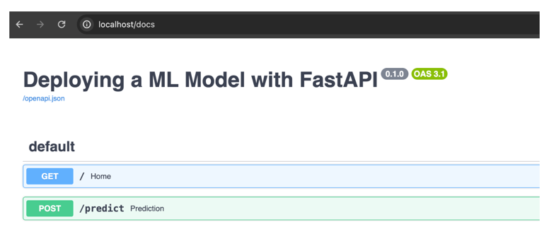
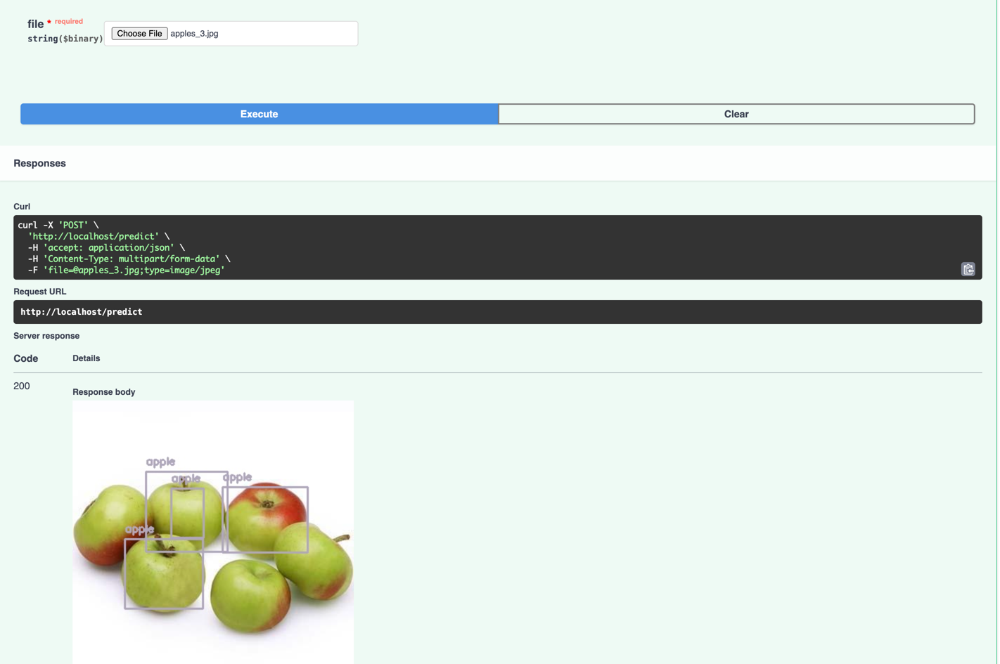

# Deplyoing a machine learning model for image recognition

Exercise for the week 1 of th "Machine Learning in production" course.

This is a Python project based on the the computer vision library cvlib and the machine learning model [yolov3](https://pjreddie.com/darknet/yolo/).

```shell
docker build -t w1_lab .
```

```shell
docker run -d --name w1_lab -p 80:9090 w1_lab

echo "Visit http://localhost:9090/docs"
```

### Test computer vision model

Upload an image of something that can be recognized, like an apple.

```shell
http://localhost:9090/docs
```



